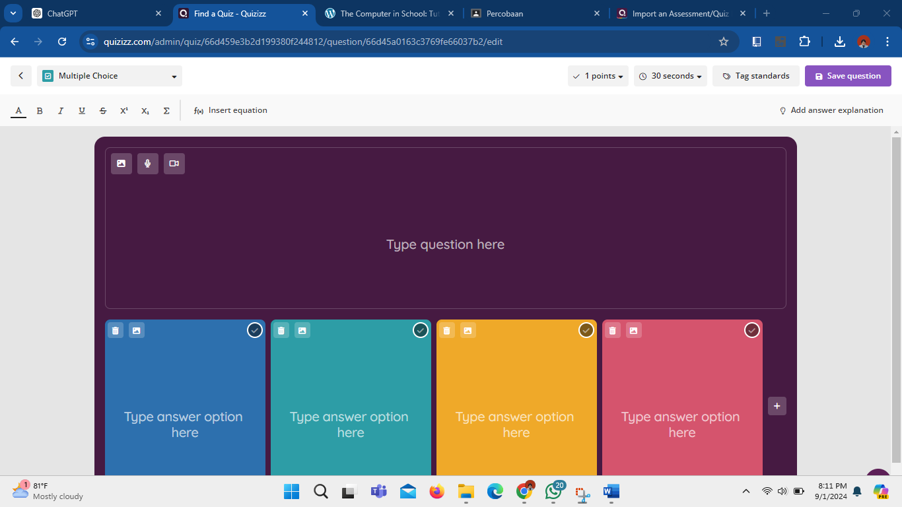

Nama : Maisya Puspita Sari
NIM  : 2110131320006
# Quizizz as Tools

Dalam peran sebagai "Computer as Tool," Quizizz menjadi alat yang mendukung proses belajar mengajar baik bagi pendidik maupun siswa. Platform ini menawarkan berbagai fitur yang memungkinkan pembuatan kuis, pemberian umpan balik secara langsung, penerapan unsur gamifikasi dalam pembelajaran, serta peninjauan dan analisis nilai siswa secara mendetail. Selain itu, Quizizz juga menyediakan integrasi dengan berbagai platform lain untuk memudahkan pengelolaan dan distribusi materi pembelajaran.

## Fitur Utama Quizizz

### 1. Pembuatan Kuis

Fitur utama yang ditawarkan oleh Quizizz adalah kemampuan untuk membuat kuis. Dengan antarmuka yang intuitif, pendidik dapat mulai membuat kuis dengan memilih template yang tersedia atau membangun kuis dari awal, menentukan jenis pertanyaan, mengimpor konten, serta menyesuaikan tampilan sesuai kebutuhan. 

Untuk mempercepat proses pembuatan kuis, pendidik juga dapat mengimpor pertanyaan dari file CSV atau dokumen lain, memungkinkan mereka menggunakan materi yang sudah ada tanpa harus membuat pertanyaan baru.

### 2. Umpan Balik Langsung

Salah satu fitur andalan Quizizz adalah kemampuannya memberikan umpan balik langsung kepada siswa setelah mereka menjawab setiap pertanyaan. Umpan balik ini mencakup informasi mengenai jawaban yang benar atau salah, disertai penjelasan singkat yang membantu siswa memahami kesalahan mereka dan memperkuat pemahaman terhadap konsep yang benar.

### 3. Gamifikasi

Fitur berikutnya adalah gamifikasi, di mana Quizizz menyediakan leaderboard, poin, serta opsi kustomisasi avatar dan tema yang meningkatkan motivasi dan keterlibatan siswa dalam pembelajaran.

### 4. Peninjauan Nilai Siswa

Untuk peninjauan nilai siswa, Quizizz menyediakan laporan kinerja yang mendalam setelah kuis selesai. Laporan ini mencakup berbagai metrik seperti skor total, jawaban per pertanyaan, waktu pengerjaan, dan distribusi jawaban siswa. Laporan ini memberikan wawasan berharga bagi pendidik mengenai pemahaman siswa terhadap materi dan area yang perlu ditingkatkan. Selain itu, Quizizz memungkinkan pelacakan kemajuan siswa dari waktu ke waktu dengan menyimpan data kuis dalam profil siswa, memudahkan analisis perkembangan dan perencanaan strategi pengajaran. Pendidik juga dapat mengunduh hasil kuis dalam format Excel, yang mempermudah penyimpanan data, analisis lebih lanjut, atau integrasi dengan sistem manajemen nilai sekolah.

### 5. Integrasi dengan Platform Lain

Terakhir, Quizizz mendukung integrasi dengan berbagai platform lain seperti Google Classroom dan Microsoft Teams yang memudahkan sinkronisasi dan pengelolaan pembelajaran dalam satu ekosistem.
