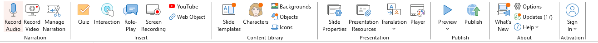

Nama : Maisya Puspita Sari
NIM  : 2110131320006
## Ispring
iSpring adalah platform perangkat lunak yang menyediakan berbagai alat untuk membuat konten e-learning, seperti kursus interaktif, presentasi, kuis, dan modul pembelajaran. iSpring sering digunakan oleh pendidik, pelatih, dan profesional di bidang pengembangan sumber daya manusia untuk menciptakan materi pembelajaran yang efektif dan menarik.

### Fitur Utama Ispring

#### 1. Narration
1. **Record Audio**: Merekam audio langsung untuk digunakan dalam slide presentasi atau kursus.
2. **Record Video**: Merekam video narasi menggunakan webcam untuk melengkapi presentasi.
3. **Manage Narration**: Mengelola dan menyinkronkan file audio dan video yang telah ditambahkan ke dalam slide.

#### 2. Insert
1. **Quiz**: Membuat kuis interaktif menggunakan iSpring QuizMaker, dengan berbagai jenis pertanyaan.
2. **Interaction**: Menambahkan interaksi interaktif seperti FAQ, timeline, atau langkah-langkah proses.
3. **Role-Play**: Membuat simulasi percakapan untuk melatih keterampilan komunikasi.
4. **Screen Recording**: Merekam layar untuk membuat tutorial atau demonstrasi langkah-langkah.
5. **YouTube**: Menyisipkan video dari YouTube ke dalam presentasi.
6. **Web Object**: Menambahkan konten web, seperti halaman web atau aplikasi online, ke dalam slide.

#### 3. Content Library
1. **Slide Templates**: Menyediakan template slide yang dapat digunakan untuk mempercepat pembuatan presentasi.
2. **Character**s: Menambahkan karakter animasi atau ilustrasi untuk meningkatkan daya tarik visual.
3. **Backgrounds**: Menyediakan berbagai latar belakang untuk memperindah tampilan slide.
4. **Objects**: Menambahkan objek seperti grafik, ikon, atau elemen visual lainnya.
5. **Icons**: Koleksi ikon yang bisa digunakan untuk menonjolkan poin-poin penting dalam slide.

#### 4. Presentation
1. **Slide Properties**: Mengatur properti slide, seperti durasi atau transisi antar-slide.
2. **Presentation Resources**: Menambahkan sumber daya seperti dokumen, file PDF, atau tautan ke slide.
3. **Translation**: Mempermudah penerjemahan teks dalam presentasi ke berbagai bahasa.

#### 5. Publish
1. **Player**: Mengkustomisasi tampilan pemutar (player) untuk kursus e-learning.
2. **Preview**: Melihat tampilan akhir presentasi sebelum dipublikasikan.
3. **Publish**: Menerbitkan presentasi dalam berbagai format, seperti SCORM, xAPI, atau HTML5.

#### 6. About
1. **What’s New:** Melihat fitur terbaru yang telah ditambahkan dalam versi iSpring yang digunakan.
2. **Options**: Mengakses pengaturan perangkat lunak iSpring untuk menyesuaikan preferensi pengguna.
3. **Updates**: Memeriksa dan mengunduh pembaruan perangkat lunak.
4. **Help**: Mengakses panduan pengguna dan dukungan teknis.
5. **Sign In**: Masuk ke akun iSpring untuk mengelola lisensi atau fitur cloud.
